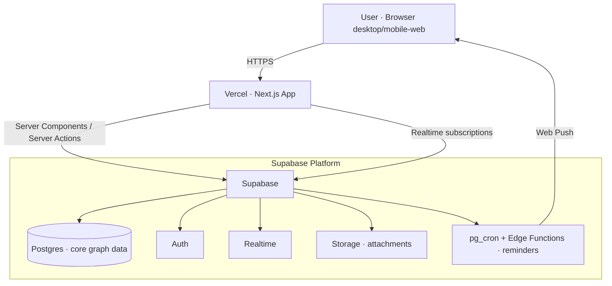

# System Architecture

*Document 3 of 5 — Foundational Planning Series*
*Status: Draft for review*
*Builds on: 01-user-stories.md, 02-prd.md*

---

## Confirmed Inputs Driving This Architecture

- **Full rich text** for notes, reflections, and project logs → a serious headless editor (Tiptap/ProseMirror).
- **Simple recurrence** → no heavy scheduling engine needed.
- **Online-first** *(assumed — confirm)* → a managed cloud database is the source of truth; we are **not** building a local-first sync engine in v1.
- **Multi-device sync from day one** *(assumed — confirm)* → cloud data layer with realtime updates.
- **Quality, scalability, and exceptional UI/UX over speed** → best-in-class tools, even where they cost setup effort.

---

## 1. Architecture Philosophy

The shape is deliberately simple and proven, so that effort goes into **craft** rather than fighting infrastructure:

- A **Next.js (React) single web application** for a fast, premium, app-like frontend.
- A **managed Postgres data layer (Supabase)** providing the database, authentication, realtime updates, and file storage in one coherent platform — fewer moving parts, which is exactly what "don't over-complicate" calls for.
- A **type-safe spine end to end** — TypeScript everywhere, a typed schema, validated boundaries — because this app will live and grow for years, and types are what keep a long-lived codebase from rotting.
- Deployed on **Vercel + Supabase cloud**, both best-in-class managed platforms that scale without you running servers.

The guiding principle: **a small number of excellent, well-integrated tools** beats a sprawl of clever ones. Everything below is chosen to be both top-tier *and* coherent with the rest.

---

## 2. The Stack, Layer by Layer

For each: **what it is**, **why it's the right call here**, and **what to install / set up**.

### 2.1 Foundation — Language, Runtime, Package Manager

**TypeScript** — the entire codebase is typed.
- *Why:* a multi-year personal system must stay refactorable. Types catch whole categories of bugs and make the connected-graph data model safe to evolve.

**Node.js (latest LTS)** — runtime for the framework and tooling.

**pnpm** — package manager.
- *Why:* faster and more disk-efficient than npm/yarn, with stricter dependency resolution that prevents subtle "phantom dependency" bugs.

**Set up:**
- Install Node.js LTS (via the official installer or a version manager like `fnm`/`nvm`).
- Enable pnpm: `corepack enable pnpm`.

### 2.2 Frontend Framework — Next.js (App Router) + React

**Next.js** with the App Router, on **React**.
- *Why:* the most mature, best-supported React meta-framework. Server Components and Server Actions let us keep the UI fast and the data-fetching clean, while still building a rich, app-like client experience. It's the natural pairing with Vercel hosting and has the deepest ecosystem for everything else we need.
- *Alternative considered:* React Router v7 (Remix). Excellent, but Next.js's ecosystem depth and Vercel integration win for a long-term solo build.

**Set up:**
- `pnpm create next-app@latest` — choose TypeScript, App Router, Tailwind.

### 2.3 Styling & UI Primitives — Tailwind + Radix + shadcn/ui

This trio is the toolkit behind most "how is this so polished?" web apps.

**Tailwind CSS** — utility-first styling.
- *Why:* fast, consistent, and keeps styling colocated with components. A shared design-token config (colors, spacing, radius, typography) enforces a coherent visual language — essential for a premium feel.

**Radix UI primitives** — unstyled, fully accessible component behaviors (menus, dialogs, popovers, tooltips).
- *Why:* getting accessibility and interaction details *right* (focus traps, keyboard nav, ARIA) is enormously hard; Radix solves it, and you style on top so nothing looks generic.

**shadcn/ui** — pre-built components that combine Radix + Tailwind, copied into *your* codebase (not an opaque dependency).
- *Why:* you own and restyle every component — the opposite of a generic component-library look. It's the fastest path to a custom, premium UI without sacrificing control.

**Set up:**
- Tailwind comes with the Next.js scaffold.
- `pnpm dlx shadcn@latest init`, then add components as needed (`pnpm dlx shadcn@latest add button dialog ...`). Radix arrives as their dependencies.

### 2.4 Rich Text — Tiptap (on ProseMirror)

**Tiptap** — headless rich text editor framework.
- *Why:* your "full rich text" requirement demands a serious editor. Tiptap is built on ProseMirror (the same engine behind Notion-class editors), is fully headless so it matches your design language, and supports exactly the features you'll want: headings, lists, checklists, links, code, and inline formatting. It outputs structured **JSON**, which we store directly in Postgres (`JSONB`) — clean and queryable.
- *Scope discipline:* we use Tiptap's standard extensions, not collaborative editing or exotic features — keeping it powerful but not complex.

**Set up:**
- `pnpm add @tiptap/react @tiptap/pm @tiptap/starter-kit` plus any extra extensions (e.g. task list, link).

### 2.5 Interaction Libraries — the "premium feel" layer

**Motion** (the animation library formerly Framer Motion) — micro-interactions and transitions.
- *Why:* tasteful motion (items settling into place, smooth view transitions, satisfying check-offs) is a large part of what makes an app feel crafted rather than templated.

**cmdk** — the command palette.
- *Why:* directly powers ORG-3; a keyboard-driven palette is a signature of power-user-grade tools (Linear, Raycast, Superhuman).

**dnd-kit** — drag and drop.
- *Why:* powers kanban reordering (VIEW-3) and manual task prioritization (TSK-6) with accessible, performant DnD.

**Set up:**
- `pnpm add motion cmdk @dnd-kit/core @dnd-kit/sortable`.

### 2.6 Client Data & State

**TanStack Query** — server-state management (fetching, caching, background refresh).
- *Why:* makes the UI feel instant and always-fresh via caching and optimistic updates, without hand-rolling cache logic. Pairs naturally with Supabase's realtime to keep multiple devices in sync.

**Zustand** — lightweight local UI state (modals, palette open/closed, view preferences).
- *Why:* minimal, ergonomic, no boilerplate — the right size for the small slice of state that's purely client-side.

**Set up:** `pnpm add @tanstack/react-query zustand`.

### 2.7 Backend & Database — Supabase + Postgres + Drizzle

This is the spine, and the most consequential choice.

**Postgres (managed by Supabase)** — the database.
- *Why Postgres:* your product is a **connected graph of relational items** (tasks↔projects↔follow-ups↔learning↔goals). A relational database with real foreign keys and join performance is the natural, durable fit — far more so than a document store. Postgres also gives us `JSONB` (for rich-text content), built-in full-text search (for ORG-1), and a path to scale that lasts years.

**Supabase** — the platform wrapping Postgres with **Auth, Realtime, Storage, and scheduled functions**.
- *Why:* it delivers everything the PRD needs from one coherent, managed platform — which is precisely how we honor "best-in-class" *and* "don't over-complicate." It's open-source and standard Postgres underneath, so there's **no lock-in**: your data is portable and exportable (satisfying ACC-3).
- *Alternative considered:* **Convex** (a reactive backend with realtime-by-default queries). Genuinely excellent and makes snappy UIs simpler — but it uses a document model rather than relational Postgres, which is a weaker fit for this app's heavily relational graph, and it's more of a platform commitment. Supabase keeps you on portable SQL. *(If you'd prefer the reactive-document approach, flag it — it's a legitimate fork.)*

**Drizzle ORM** — the type-safe query/schema layer.
- *Why:* defines the database schema in TypeScript and gives fully-typed queries, so the database and application share one source of truth. Lighter and closer to SQL than the alternatives, which suits a relational-heavy design.
- *Alternative considered:* Prisma — more batteries-included but heavier; Drizzle's transparency wins here.

**The connected-graph data model (the heart of the system):**
- Core tables: `projects`, `tasks`, `follow_ups`, `learning_items`, `goals`, `areas`, plus `inbox_items`, `reviews`.
- A single generic **`links` table** (`from_type`, `from_id`, `to_type`, `to_id`, `relation`) models the bidirectional any-to-any relationships (REL-1/REL-2). This one table is what makes the "everything connects" promise real and is foundational from day one, exactly as the PRD requires.
- Rich text stored as `JSONB`; tags via a `tags` table + join; areas as a lightweight category reference.

**Set up:**
- Create a project at supabase.com (free tier to start; scales up cleanly).
- `pnpm add drizzle-orm postgres` and `pnpm add -D drizzle-kit`.
- Connect Drizzle to the Supabase Postgres connection string; manage schema with Drizzle migrations.

### 2.8 Authentication — Supabase Auth

**Supabase Auth** — email/password and OAuth, with row-level security.
- *Why:* it's built into the platform, so there's one fewer service to run. Postgres **Row-Level Security** ties every row to your user ID at the database level — strong protection for your entire life's data (ACC-1), enforced even below the application layer.
- *Alternative considered:* **Clerk** — gorgeous pre-built auth UX. Worth it for a multi-user product; for a single-user system, Supabase Auth is simpler and entirely sufficient. *(Easy to swap to Clerk later if you ever want that polish.)*

**Set up:** enable Auth providers in the Supabase dashboard; add the Supabase client library (`pnpm add @supabase/supabase-js @supabase/ssr`); write RLS policies.

### 2.9 Reminders & Scheduled Jobs

Follow-up nudges, due reminders, and "inbox/review overdue" prompts (NOT-1…3) need something that runs on a schedule.

**Supabase `pg_cron` + Edge Functions**, delivering **Web Push** notifications to the browser.
- *Why:* keeps scheduling inside the same platform — `pg_cron` triggers a function that finds due reminders and pushes them. No extra infrastructure, and it scales fine for a single user.

**Set up:** enable `pg_cron`; write an Edge Function for due-reminder dispatch; register a Web Push service worker on the client.

### 2.10 Validation, Forms & Dates

- **Zod** — runtime schema validation at every boundary (forms, API inputs), and it pairs with Drizzle for end-to-end type safety. `pnpm add zod`.
- **React Hook Form** — performant forms, integrates with Zod. `pnpm add react-hook-form @hookform/resolvers`.
- **date-fns** — date math/formatting. **chrono-node** — natural-language date parsing for quick-capture (CAP-6). `pnpm add date-fns chrono-node`.

### 2.11 Code Quality & Testing

- **Biome** — fast all-in-one linter + formatter (a modern single-tool replacement for ESLint + Prettier). `pnpm add -D @biomejs/biome`. *(If you prefer the established standard, ESLint + Prettier is the safe alternative.)*
- **Vitest** — unit tests. **Playwright** — end-to-end tests of the critical flows (capture, today view, review). `pnpm add -D vitest @playwright/test`.
- *Why testing from the start:* this system becomes load-bearing for your life; the core flows deserve a safety net so future changes don't silently break capture or sync.

### 2.12 Hosting & Deployment

- **Vercel** — hosts the Next.js frontend.
  - *Why:* built by the Next.js team; zero-config deploys, a global edge network for speed, and preview deployments on every change. Best-in-class DX for this framework.
- **Supabase Cloud** — hosts Postgres, Auth, Realtime, Storage, scheduled functions.
- **GitHub** — source control; connect the repo to Vercel for automatic deploys.

**Set up:** push to GitHub → import the repo in Vercel → add Supabase environment variables → deploys happen on every push.

---

## 3. End-to-End Setup Checklist

A concrete order of operations once you approve:

1. Install Node.js LTS; `corepack enable pnpm`.
2. `pnpm create next-app@latest` (TypeScript, App Router, Tailwind).
3. `pnpm dlx shadcn@latest init`; add base components.
4. Create a Supabase project; grab the connection string and keys.
5. Add Drizzle; define the initial schema (core tables + `links` + `tags`); run the first migration.
6. Wire Supabase Auth + Row-Level Security.
7. Add the libraries: Tiptap, TanStack Query, Zustand, Motion, cmdk, dnd-kit, Zod, React Hook Form, date-fns, chrono-node.
8. Set up Biome, Vitest, Playwright.
9. Create a GitHub repo; connect Vercel; configure environment variables.
10. Ship a "hello world" through the full pipeline (auth → DB read/write → deploy) before building features — proving the spine end to end.

---

## 4. Why This Stack Honors "Quality, Scalability, and Exceptional UI/UX"

- **UI/UX:** Tailwind + Radix + shadcn + Motion + Tiptap + cmdk + dnd-kit is, conceptually, the exact toolkit behind the most admired web apps (Linear-class polish). It's built for *custom* excellence, not generic dashboards.
- **Scalability:** Postgres and these managed platforms scale from one user to many without re-architecting; the `links`-table graph model and typed schema are designed to grow for years.
- **Quality/longevity:** end-to-end TypeScript, validated boundaries, tests on critical flows, and a portable, no-lock-in data layer mean the system stays maintainable over the long haul.
- **Restraint:** one coherent platform (Supabase) instead of five stitched services — powerful without being needlessly complex, as you asked.

---

## 5. Decisions I Need From You

1. **Confirm online-first** (vs. true offline support). This is the single biggest architectural fork — offline would push us toward a local-first sync engine (more sophisticated, more complex).
2. **Confirm multi-device sync from day one** (assumed yes).
3. **Supabase vs. Convex** — I recommend Supabase (relational fit + portability). Comfortable with that, or do you want to weigh the reactive-document approach?
4. **Auth:** Supabase Auth (recommended, simpler) vs. Clerk (more polished flows). Fine to start with Supabase and revisit?
5. **Biome vs. ESLint+Prettier** — minor; I recommend Biome, but if you want the conventional standard, say so.

---

## Addendum: Offline Support (approved direction)

**Decision: online-first source of truth, with a pragmatic offline-resilience layer.** Not a full local-first rebuild.

**What we build now (v1):**
- **PWA / service worker** (via Serwist) so the app shell loads with no connection.
- **Persisted query cache** — TanStack Query's cache persisted to **IndexedDB**, so your data is readable offline.
- **Offline write queue (outbox)** — mutations made offline are stored locally, the UI updates optimistically, and the queue flushes automatically on reconnect.
- **Reconciliation** — Supabase realtime + `updated_at` timestamps bring devices back in sync; with a single user, conflicts are rare, so **last-write-wins** is acceptable for v1.

*Why this and not full local-first:* it delivers the "works on a plane, syncs when I'm back" experience you asked for, without the substantial complexity of a CRDT sync engine — honoring "don't make it too complex."

**Deferred (possible later upgrade):** true local-first with a dedicated sync engine (ElectricSQL / PowerSync / Zero-class) and real conflict resolution. Revisit only if the pragmatic layer proves insufficient in daily use.

*Setup additions:* `pnpm add @serwist/next serwist` for the PWA layer; `pnpm add @tanstack/react-query-persist-client idb-keyval` for cache persistence.

---

## Confirmed Decisions (locked)

1. **Online-first + pragmatic offline resilience** (per addendum above). ✅
2. **Multi-device sync from day one.** ✅
3. **Supabase + Postgres + Drizzle** (relational graph, portable, no lock-in). ✅
4. **Supabase Auth** to start (Clerk a later option). ✅
5. **Biome** for lint/format. ✅

---

*Architecture **approved**. Next document in sequence: **UI/UX Design Direction** — assuming this stack (Tailwind / Radix / shadcn / Motion / Tiptap) and defining the visual language and interaction patterns built on top of it.*
